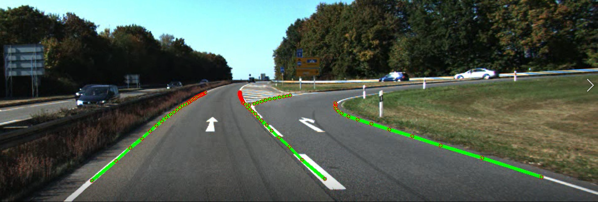

<meta http-equiv="X-UA-Compatible" content="IE=Edge,chrome=1">

## About me

Hi, I'm Jiaxin. I'm currently an undergraduate student in Beijing, China. Specifically, I am interested in high-level, symbolic processes of **image recognition** and interpretation that accurately model the way people interact with the world.

Besides, I also dive into the field of **networking** and **system**, now I am a research intern in the Network Research group of Microsoft Research Asia (MSRA). My CV is available on the left side (updated Dec 2018).

Additionly, I love digital painting, you can see my work in [My art work](https://photos.google.com/share/AF1QipOVooov5Zav8ADyYoYuFBqVz4_sWCLplyxZyXAuT9sFbsXajnxg6QTqWDu78W_3dw?key=X1d1X0RjSTZxdjJUcWJNTzBsaW9BZGRPb1JNMzBn)  :)

- [My Project](#my-project) 
  - [Free Virtual Piano System](#free-virtual-piano-system) 
  - [Mono 3D Detection](#mono-3d-detection) 
  - [Semiautomatic annotation](#semiautomatic-annotation) 
  - [Bird-view lane detection](#bird-view-lane-detection) 
  - [Glane-On-CPU](#glane-on-cPU) 
- [My artwork](#my-artwork) 


## My Project

### Free Virtual Piano System
- Translate hands movement on paper with printed piano keys to music. [Detail](/pages/Page_1.md)


```diff
- Please play with high volume
```

<video src="src/piano.mp4" width="320" height="200" controls preload></video>


### Mono 3D Detection
- Combine neural network’s estimates with geometric constraints provided by a 2D object bounding box to produce a complete 3D bounding box. [Detail](/pages/Page_2.md)


### Semiautomatic annotation
- Work on semiautomatic annotation. Use CAD models to generate 2D point coordinates on real images in KITTI dataset.
- [Detail](/pages/Page_3.md)


### Bird-view lane detection
- Using vanishing point to adaptively transform image into bird view.
- Detecting lane lines in bird view using FCN-based neural network architecture.
- Tracking the lane lines by semi-dense direct visual odometry and Kalman Filter.




### Glane-On-CPU
- Project in Network Research Group, Microsoft Research Asia
- Design and implementation of Glane Communication Stack, a coordinator in Terminus which communicates with CPU and FPGA. Aiming to accelerate data preprocessing in machine learning.
- Glane Streaming NIC Stack design and implementation. We advocate a new hardware solution, Direct Connect NIC, specific for streaming communication. Aiming to solve RDMA’s inefficient API support and poor scalability problem in streaming communication. (Ongoing).


## My Artwork

[**Click Here!**](https://photos.google.com/share/AF1QipOVooov5Zav8ADyYoYuFBqVz4_sWCLplyxZyXAuT9sFbsXajnxg6QTqWDu78W_3dw?key=X1d1X0RjSTZxdjJUcWJNTzBsaW9BZGRPb1JNMzBn)

