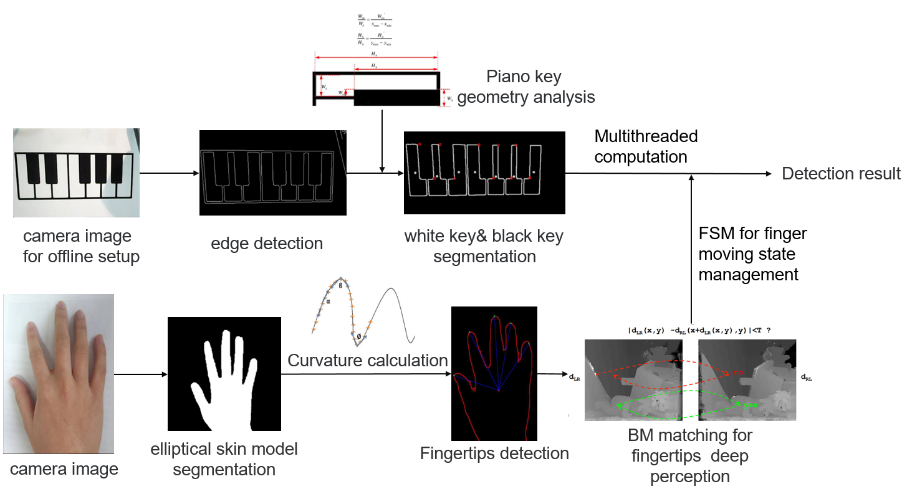

## Free Virtual Piano System

The project - Free Virtual Piano System - derives from a whimsy dream in my childhood: in the magic world, people play the music everywhere, on the wall, on the table or even in the air. My goal was to translate hand movement on paper with printed piano keys into actual music.

The system contains a binocular camera, a paper with standard piano graphic and a computing platform:

Figure 1. Lena

I use Binocular Stereo Vision, Elliptical Skin Model, Block Matching algorithm, piano pattern recognition, and camera demarcation. Here is the algorithm flow:

Specially, this peoject have several interesting problem, let me share them with you:
- [x] The key pressing motion is slight, how to detect it?
- [x] If we keep pressing on the piano key, the piano will only ring once, how to realize this feature?
- [x] How to avoid the occlusion from hands when we detecting piano key?
- [x] ...

