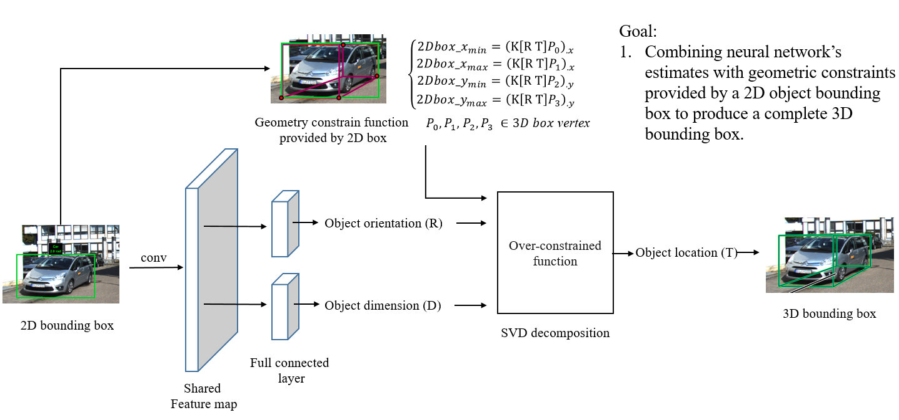
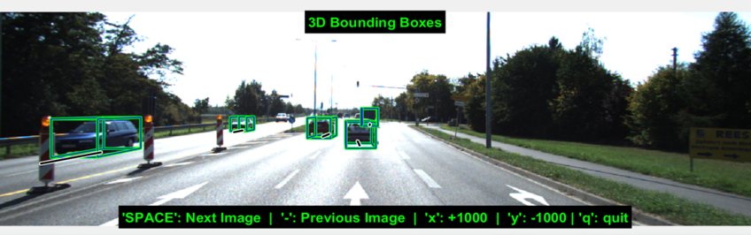
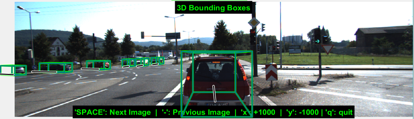
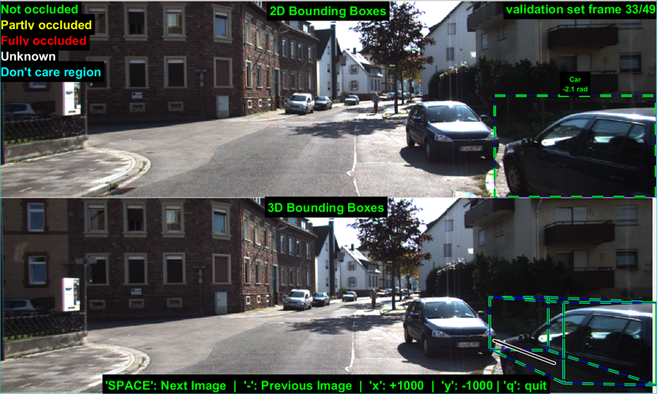
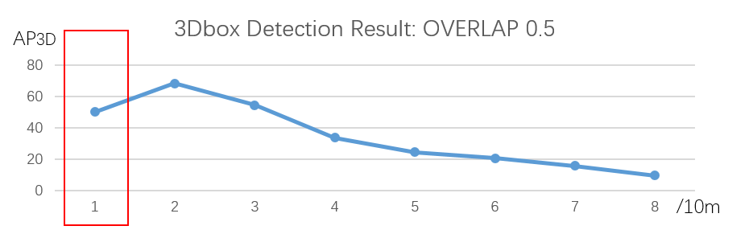
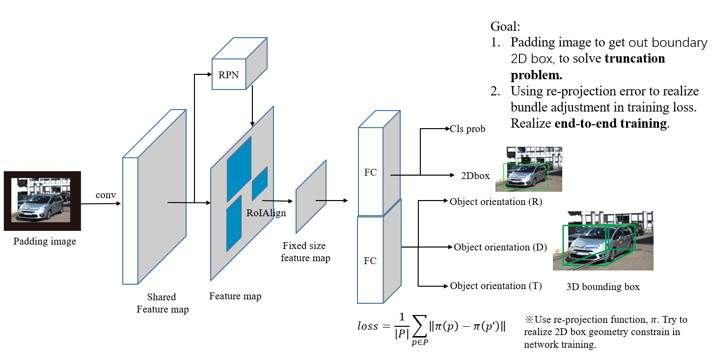

# Mono 3D Detection 
In monocular scenario, the main difficulty in neural network focuses on location regression, which keeps huge variance; thus the network is difficult to converge. 

The first project combines neural network’s estimates with geometric constraints provided by a 2D object bounding box to produce a complete 3D bounding box. This strategy maintains the consistency between 2D-box estimation and 3D-box estimation.   

Specially, this method have several limitations, just like the above result shows:
- [x] None truncation scenario: success 3D box estimation.
- [ ] Truncation scenario: failed, because geometry constraint cannot apply to truncated 2D box.
- [ ] End-to-end training : not support, because it relys on 2D detection result. 

Thus my next part of work focus on padding image to get out boundary 2D box, to solve truncation problem; use re-projection error to realize bundle adjustment in training loss,then realize end-to-end training.

