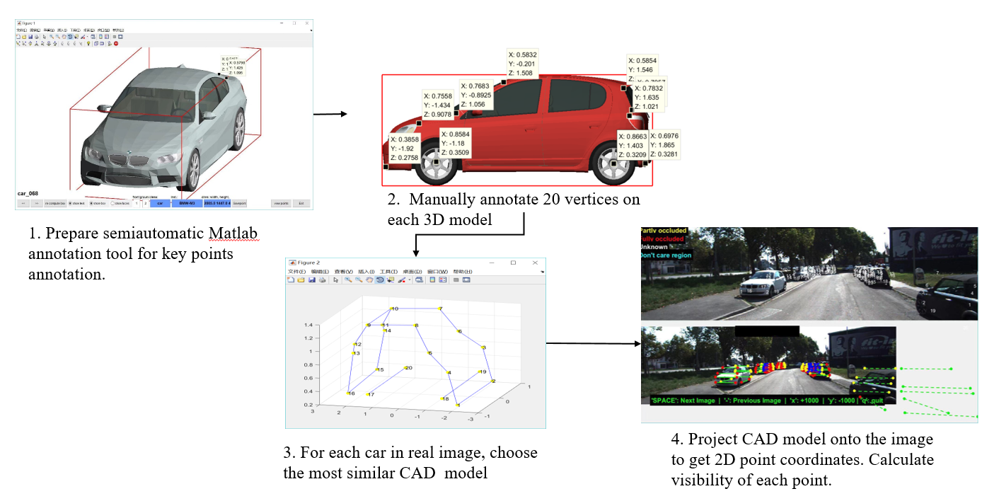
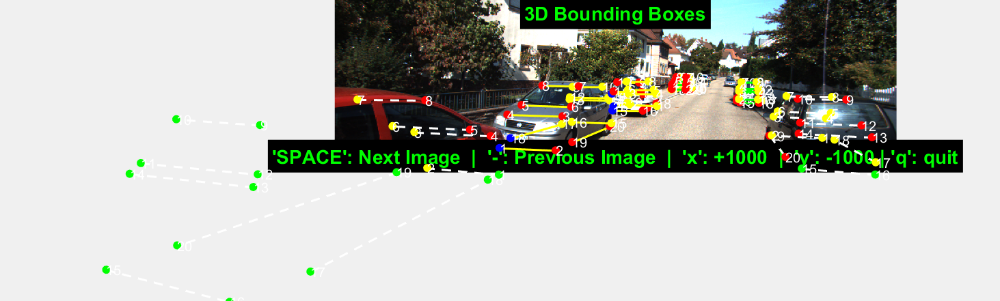
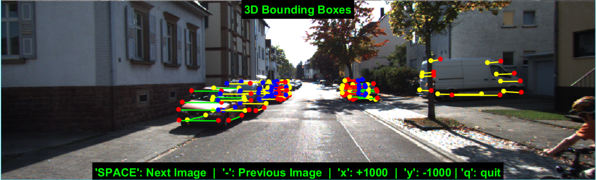
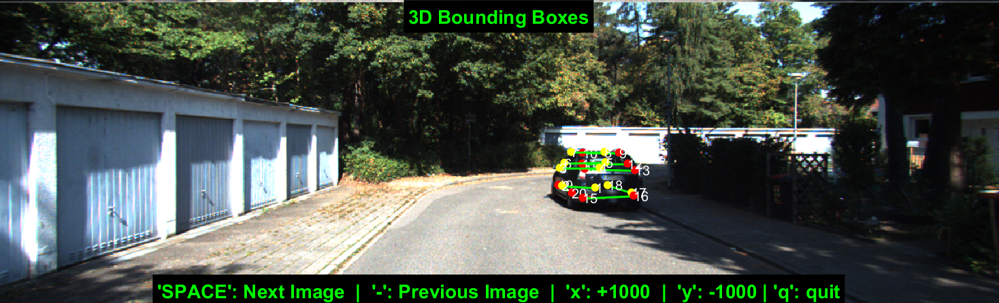

# Semiautomatic annotation
In this project, I use CAD models to generate 2D point coordinates on real images in KITTI dataset, and generate visible type for each label. I defined 20 key points for each CAD modle, and there are 4 types of visibility:
- Self-occlusion (Yellow &#x1F49B;)
- Other-occlusion (Blue &#x1F499;)
- Truncation (Green &#x1F49A;)
- Visible (Red ❤️)

